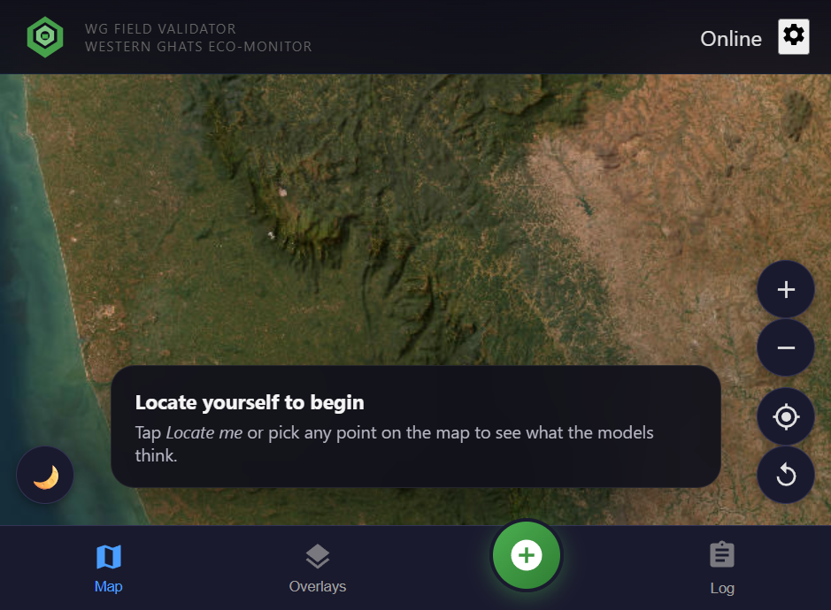
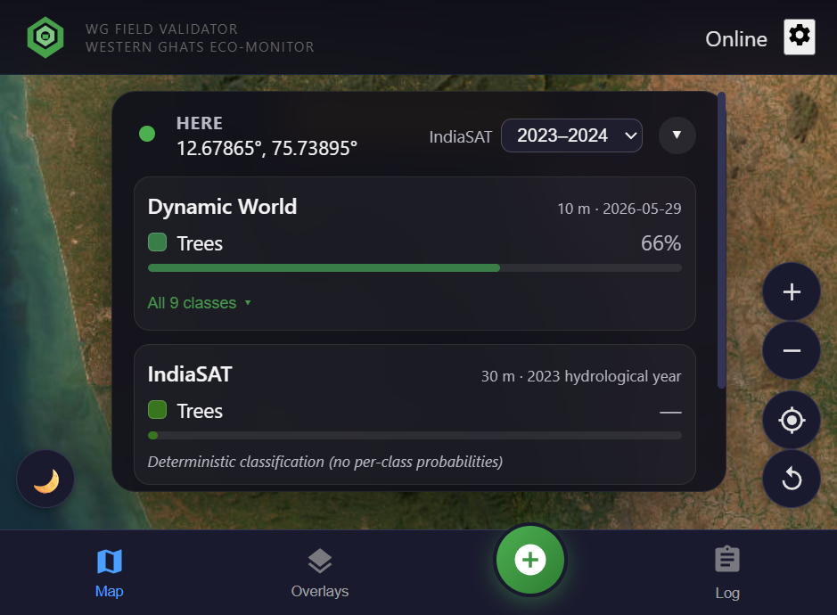
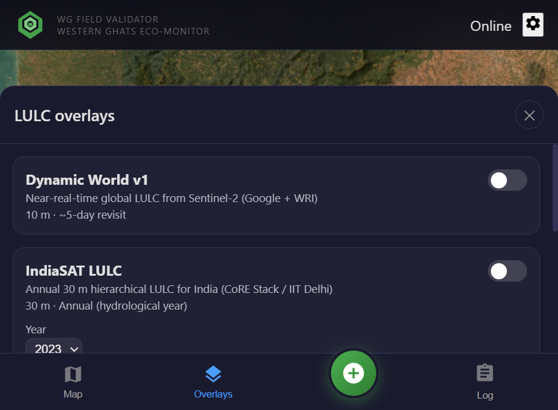
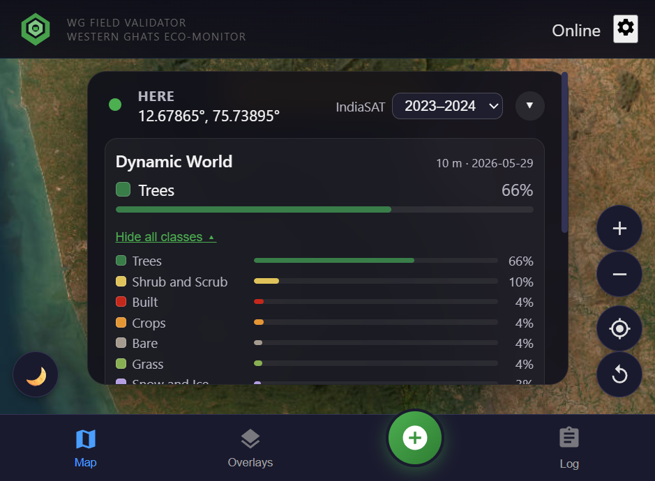
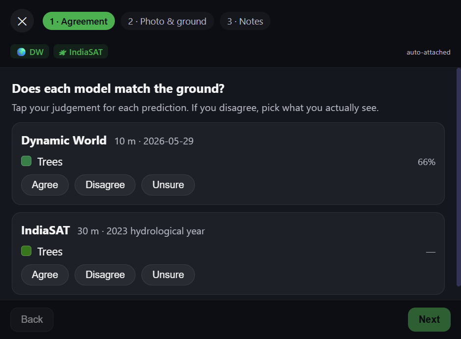
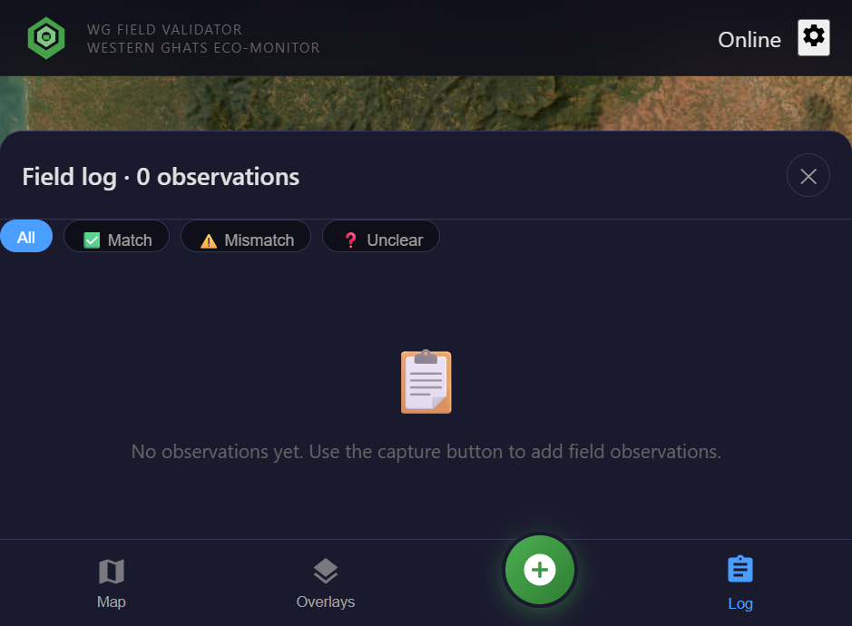

# Field Validator

A mobile-first field data collection application for validating and ground-truthing Land Use/Land Cover (LULC) geospatial datasets. Built for offline-first operation with seamless integration of CoRE Stack APIs and Google Earth Engine Dynamic World data.

## Overview

Field Validator enables practitioners, researchers, and community workers to collect ground-truth observations for LULC datasets in the field. The application is designed for challenging connectivity environments, functioning fully offline while providing enhanced capabilities when connected to the internet.

### Key Capabilities

- **Offline-First Architecture**: All core functionality works without internet connectivity. Preloaded basemaps, cached layers, and local storage ensure field teams can work in remote areas.

- **CoRE Stack Integration**: Live access to CoRE Stack's comprehensive geospatial layers including watershed data, waterbodies, cropping patterns, and socio-ecological indicators.

- **Dynamic World LULC**: Real-time land cover classification from Google Earth Engine's Dynamic World dataset, providing 10m resolution class labels and confidence scores.

- **Field Observation Workflow**: Structured data collection with GPS coordinates, photographs, land cover classification, and field notes. Observations sync when connectivity is restored.

- **Cross-Platform Deployment**: Runs as a Progressive Web App (PWA) in any modern browser, or as a native Android application via Capacitor.

## Screenshots

| Map View | Prediction Card | Overlays Panel |
|----------|----------------|----------------|
|  |  |  |

| All Classes | Validation Wizard | Field Log |
|-------------|-------------------|-----------|
|  |  |  |

## Architecture

The application is built with:

- **Frontend**: React 18 with TypeScript, MapLibre GL for mapping, TailwindCSS for styling
- **Build System**: Vite for fast development and optimized production builds
- **Mobile**: Capacitor for native Android packaging with camera, GPS, and filesystem access
- **Backend Proxy**: Node.js Express server for Google Earth Engine authentication (required only for Dynamic World features)

## Installation

### Prerequisites

- Node.js 18 or higher
- npm or pnpm package manager
- Android Studio (for APK builds)
- A CoRE Stack API key (obtain from [core-stack.org/use-apis](https://core-stack.org/use-apis/))

### Setup

1. Clone the repository:

```bash
git clone https://github.com/tkkr6895/fields.git
cd fields/field-validator-app
```

2. Install dependencies:

```bash
npm install
```

3. Configure environment variables:

```bash
cp .env.example .env
```

Edit `.env` and add your credentials:

```
VITE_CORESTACK_API_KEY=your_api_key_here
GEE_PROJECT=your_gee_project_id
PORT=8787
```

4. Start the development server:

```bash
npm run dev
```

The application will be available at `http://localhost:5173`

### Running with Dynamic World Support

To enable live Dynamic World data from Google Earth Engine:

1. Authenticate with Earth Engine CLI:

```bash
earthengine authenticate
```

2. Start both servers:

```bash
npm run dev:full
```

This launches the Vite development server and the Earth Engine proxy simultaneously.

## Download Pre-Built APK

Pre-built APKs are available from the [Actions](https://github.com/tkkr6895/fields/actions) page. To install:

1. Click on the latest action which ran successfully
2. Download the latest artifact in the build. Decompressing it should reveal an `app-debug.apk`
3. On your Android device, enable "Install from unknown sources" in Settings
4. Open the downloaded APK and tap Install
5. Launch the app and configure your API key in Settings

## Building for Production

### Web Application

```bash
npm run build
```

Production assets are generated in the `dist/` directory.

### Android APK

Requires Android SDK and Java 17+:

```bash
npm run build
npm run android:sync
cd android
./gradlew assembleDebug
```

The APK is generated at `android/app/build/outputs/apk/debug/app-debug.apk`

### Automated Builds

The repository includes GitHub Actions workflows that automatically build and publish APKs on each push to the main branch.

## Usage

### Basic Workflow

1. **Open the Application**: Launch from browser or installed APK
2. **Configure API Key**: Enter your CoRE Stack API key in Settings (first use only)
3. **Navigate to Location**: Pan and zoom to your field site, or use the GPS locate button
4. **Toggle Layers**: Use the layer panel to enable relevant basemaps and data layers
5. **Click for Information**: Tap any location to view CoRE Stack data and Dynamic World classification
6. **Record Observation**: Use the observation panel to capture ground-truth data with photos
7. **Sync Data**: Observations are stored locally and sync when connectivity is available

### Layer Categories

| Category | Description |
|----------|-------------|
| Basemaps | OpenStreetMap, satellite imagery, terrain |
| Boundaries | Administrative boundaries, watershed delineations |
| Land Cover | Dynamic World live classification, historical LULC datasets |
| Water Resources | Waterbodies, drainage networks, surface water extent |
| Vegetation | Tree cover, cropping patterns, vegetation indices |
| Infrastructure | NREGA assets, settlements, roads |

### Offline Mode

When offline, the application:

- Displays cached map tiles and layer data
- Stores observations in local IndexedDB storage
- Queues photos for later upload
- Provides visual indicators of connectivity status

## Sample Field Data

Sample observations collected during field validation are available in the repository:

**[field-data/recovered-observations](https://github.com/tkkr6895/fields/tree/main/field-data/recovered-observations)**

These samples demonstrate the data structure and can be used as reference for analysis workflows.

## Data Export

The application provides multiple export pipelines for different downstream use cases. All exports operate on locally stored IndexedDB observations and can be triggered from Settings.

### Export Formats

| Format | Contents | Images | Use Case |
|--------|----------|--------|----------|
| **Standard ZIP** | JSON + GeoJSON + CSV + manifest | Yes | Backup, GIS analysis, data recovery |
| **Lightweight** | JSON + GeoJSON + CSV (no images) | No | Cloud sync, quick sharing |
| **GeoAI Bundle** | GeoJSON + CSV + STAC Items + COCO manifest + model card + SHA-256 checksums | Yes | ML training, ground-truth validation |
| **STAC-Only** | STAC Item Collection JSON | No | Interoperability with geospatial catalogues |
| **PBR** | Species checklist + GeoJSON + Traditional Knowledge records (consent-gated) | Optional | People's Biodiversity Register submissions |

### Exported Fields per Observation

Each observation record includes:

- **Spatial**: GPS coordinates, accuracy (m), altitude, administrative context (state/district/tehsil)
- **Temporal**: ISO timestamp, derived season (monsoon/post-monsoon/winter/summer)
- **Predictions**: Dynamic World class + confidence + all-class probabilities; IndiaSAT class + year
- **Validation**: Per-source agreement (agree/disagree/unsure), observer's corrected class when disagreeing
- **Ground truth**: Cover composition (tree/shrub/grass/crop/water/built/bare/other with abundance), canopy cover %, dominant species, forest type/height/disturbance, crop stage/irrigation/season, water permanence
- **Weather**: Temperature, humidity, precipitation, wind speed/direction (auto-captured at submission via Open-Meteo)
- **Photo**: Geotagged JPEG with EXIF metadata, SHA-256 checksum (in GeoAI exports)
- **Provenance**: Observer confidence (1–5), device ID, sync status, enrichment sources

### IndiaSAT Ground-Truth Compatibility

The GeoAI export (`exportGeoAI()`) produces a ready-to-ingest package for LULC model retraining. For each observation it includes:

1. The IndiaSAT prediction (class ID, class name, year) that was shown to the observer
2. The observer's agreement or disagreement, with the corrected class if they disagreed
3. Fractional cover composition matching the FAO LCCS approach (percentage per cover type)
4. A geotagged photo with SHA-256 integrity check
5. Weather conditions at the time of observation
6. STAC Item metadata for catalogue integration

Incremental export (`exportGeoAI({ incremental: true })`) sends only observations captured since the last export, suitable for periodic data shipments.

## API Integration

### CoRE Stack APIs

The application integrates with the following CoRE Stack endpoints:

| Endpoint | Description |
|----------|-------------|
| `/get_admin_details_by_latlon/` | Administrative location for coordinates |
| `/get_generated_layer_urls/` | Available GIS layers for a tehsil |
| `/get_tehsil_data/` | Comprehensive tehsil-level datasets |
| `/get_mws_data/` | Micro-watershed time series data |
| `/get_mws_kyl_indicators/` | Know Your Landscape indicators |
| `/get_waterbodies_data_by_admin/` | Waterbodies inventory |

API documentation: [api-doc.core-stack.org](https://api-doc.core-stack.org/)

A standalone Python notebook demonstrating CoRE Stack API integration is available at `docs/notebooks/corestack_api_tested.ipynb`.

### Google Earth Engine

Dynamic World integration requires:

- An active Earth Engine account
- A registered Cloud Project with Earth Engine API enabled
- Either CLI authentication or a service account

## Project Structure

```
field-validator-app/
├── src/
│   ├── components/        # React UI components
│   ├── services/          # API clients and business logic
│   ├── config/            # Layer configuration and settings
│   ├── types/             # TypeScript type definitions
│   └── utils/             # Utility functions
├── server/                # Earth Engine proxy server
├── public/                # Static assets and datasets
├── android/               # Capacitor Android project
└── docs/
    └── notebooks/         # API integration examples
```

## Configuration

### Environment Variables

| Variable | Description | Required |
|----------|-------------|----------|
| `VITE_CORESTACK_API_KEY` | CoRE Stack API key | Yes |
| `GEE_PROJECT` | Google Earth Engine project ID | For Dynamic World |
| `PORT` | Proxy server port (default: 8787) | No |

### Layer Filtering

The application filters CoRE Stack layers to prioritize those relevant for field validation. Configuration is in `src/config/westernGhatsLayers.ts`.

## Security

- API keys are loaded from environment variables, never committed to the repository
- User-entered API keys are stored only in browser localStorage
- The application requests only necessary device permissions (GPS, camera, storage)
- No telemetry or analytics are collected

See [SECURITY.md](SECURITY.md) for detailed security information.

## Troubleshooting

### Location unavailable

- Ensure GPS is enabled on your device
- Grant location permission when prompted
- Try outdoors for better GPS signal

### Map tiles not loading

- Check internet connection for initial load
- Tiles are cached after first view for offline use

### CoRE Stack data not appearing

- Verify your API key is correctly configured
- Check that the location has CoRE Stack coverage (not all areas are populated)
- Review browser console for API errors

## Contributing

Contributions are welcome. Please:

1. Fork the repository
2. Create a feature branch
3. Submit a pull request with a clear description of changes

For significant changes, please open an issue first to discuss the proposed approach.

## License

This project is released under the MIT License. See [LICENSE](LICENSE) for details.

## Acknowledgments

- [CoRE Stack](https://core-stack.org/) for geospatial data infrastructure and APIs
- [Dynamic World](https://dynamicworld.app/) for near real-time land cover classification
- [MapLibre](https://maplibre.org/) for open-source mapping
- [Capacitor](https://capacitorjs.com/) for cross-platform mobile development
