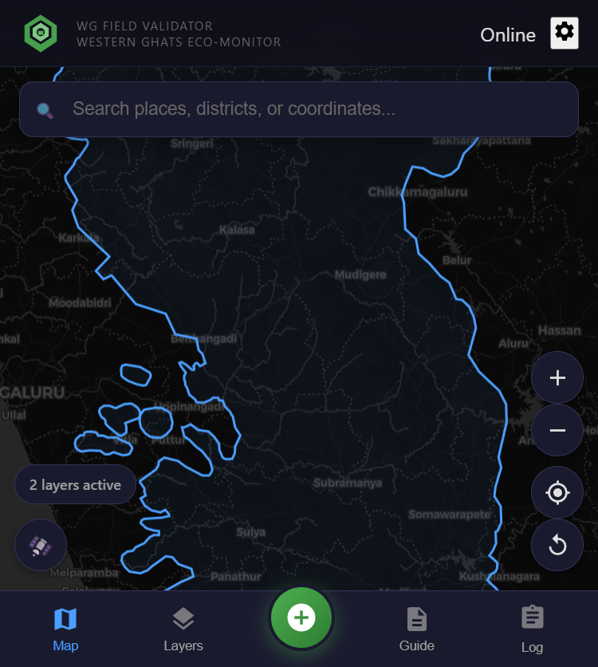
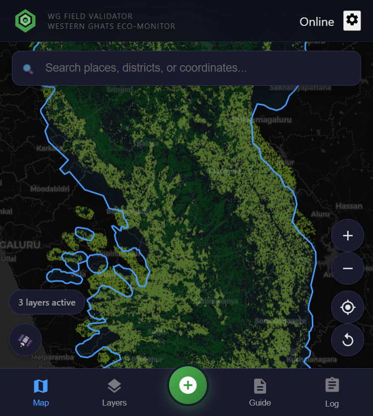
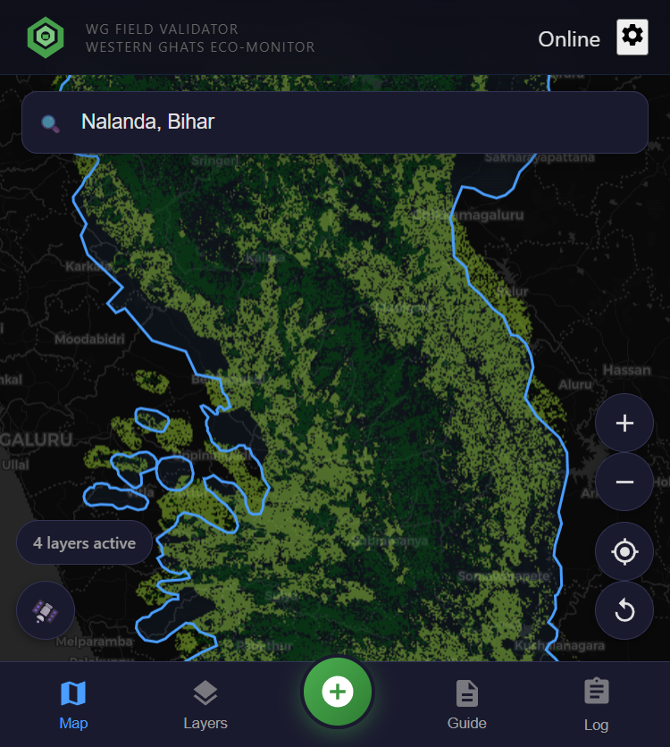
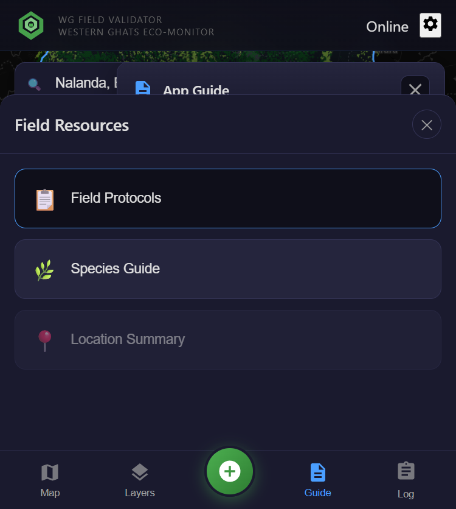
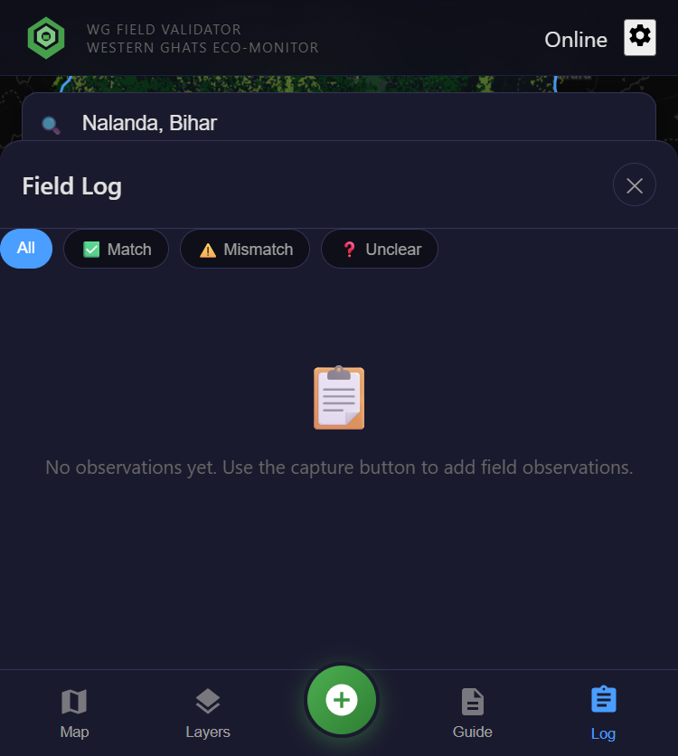

# Western Ghats Field Validator
## Application Demonstration Report

---

## Executive Summary

The Western Ghats Field Validator is a mobile-first progressive web application designed to validate satellite-derived land use and land cover (LULC) classifications through ground-truth field observations. The application integrates multiple authoritative geospatial data sources including CoRE Stack APIs, Google Dynamic World, and custom forest typology datasets to provide field researchers with actionable insights at any location.

---

## 1. Application Overview

*Figure 1: Main application interface showing the Western Ghats region with active layers*

The application provides:
- Interactive map interface with multiple base map options (OSM, Satellite)
- GPS-based location tracking for field data collection
- Offline-first architecture for remote field work
- Integration with CoRE Stack watershed data APIs
- Dynamic World LULC classification layers
- Custom forest typology layers distinguishing old growth from plantations

---

## 2. Layer Management System

*Figure 2: Layer panel showing organized categories of geospatial data*

The application organizes 31 map layers and 15 data tables across six categories:

| Category | Description | Layers |
|----------|-------------|--------|
| Forest Analysis | Plantation vs natural forest classification | 7 layers |
| Land Cover Maps | Historical LULC from GLC-FCS30D | 16 layers |
| Urban Expansion | Built-up area tracking over time | 14 layers |
| Dynamic World | Live/derived LULC from Google Earth Engine | 2 layers |
| Boundaries | Administrative boundaries | 2 layers |
| Watershed Data | Water balance and cropping intensity | 4 layers |

---

## 3. Forest Classification Layers

### 3.1 Old Growth Forest Layer

*Figure 3: Old Growth Forest classification overlaid on the Western Ghats*

The Old Growth Forest layer identifies mature, undisturbed forest areas using a combination of:
- Tree cover persistence (2000-2020)
- Height structure analysis
- Historical land use patterns
- Spatial connectivity metrics

### 3.2 Plantation Layer

*Figure 4: Combined Old Growth Forest and Plantation layers*

The Plantations layer distinguishes managed tree cover (rubber, teak, eucalyptus, oil palm, etc.) from natural forests using:
- Spectral signature analysis
- Tree cover age patterns
- Row plantation detection
- Crop cycle indicators

**Field Validation Use Case**: Researchers can verify whether satellite-classified "forest" areas are actually old-growth natural forests or commercial plantations, a critical distinction for biodiversity assessments and conservation planning.

---

## 4. Dynamic World LULC Integration

*Figure 5: Dynamic World layer options including live and regional composites*

The application integrates Google Dynamic World LULC data:

- **Dynamic World (Live GEE)**: Near real-time land cover classification (requires API key)
- **Dynamic World Regional (2018-2025)**: Pre-processed composite covering the Western Ghats

Dynamic World provides 9 land cover classes:
1. Water
2. Trees
3. Grass
4. Flooded Vegetation
5. Crops
6. Shrub & Scrub
7. Built-up
8. Bare Ground
9. Snow & Ice

---

## 5. CoRE Stack API Integration

*Figure 6: Map view with multiple analysis layers active*

The application integrates with CoRE Stack APIs to provide:

| Endpoint | Data Provided |
|----------|--------------|
| `/get_admin_details_by_latlon/` | State, District, Tehsil for any coordinate |
| `/get_mwsid_by_latlon/` | Micro-Watershed ID lookup |
| `/get_generated_layer_urls/` | Available GIS layers for a tehsil |
| `/get_tehsil_data/` | Comprehensive tehsil statistics |
| `/get_mws_data/` | Time series: ET, Runoff, Precipitation |
| `/get_mws_kyl_indicators/` | Know Your Landscape indicators |
| `/get_waterbodies_data_by_admin/` | Waterbody inventory |
| `/get_mws_report/` | MWS assessment report URL |

**Data Coverage**: Bihar and Uttar Pradesh have comprehensive CoRE Stack data coverage, enabling watershed-level analysis for field validation in these regions.

---

## 6. Field Guide and Protocols

*Figure 7: Built-in field guide with usage instructions*

The application includes comprehensive field guides covering:
- Getting started and GPS configuration
- Navigation and map controls
- Layer management
- Observation capture workflow
- Location information panel
- Field log management
- Offline mode operation

---

## 7. Field Observation Capture

*Figure 8: Field observation capture interface*

The observation capture workflow enables:

1. **Photo Documentation**: Camera or gallery image capture
2. **Automatic Location**: GPS coordinates with accuracy indicator
3. **Dataset Values**: Active layer values at current location
4. **Validation Status**:
   - ✅ Match: Satellite classification matches ground truth
   - ⚠️ Mismatch: Classification differs from observed land cover
   - ❓ Unclear: Unable to determine classification accuracy
5. **Field Notes**: Free-text documentation

---

## 8. Field Log and Data Export

*Figure 9: Field log showing captured observations with filtering*

The Field Log provides:
- Chronological list of all field observations
- Filtering by validation status (Match/Mismatch/Unclear)
- Export to JSON and CSV formats
- Offline storage with sync on connectivity

---

## 9. Satellite Base Map

*Figure 10: Satellite imagery base map for visual verification*

The application supports multiple base maps:
- OpenStreetMap (default)
- ESRI Satellite Imagery
- Dark mode for low-light conditions

---

## 10. Key Benefits

### For Field Researchers
- **Offline Capability**: Works without internet connectivity in remote areas
- **GPS Integration**: Automatic location capture with accuracy indicators
- **Multi-Layer Analysis**: Compare multiple data sources simultaneously
- **Photo Documentation**: Visual evidence linked to coordinates

### For Conservation Organizations
- **Ground Truth Collection**: Systematic validation of satellite classifications
- **Plantation vs Forest Distinction**: Critical for biodiversity assessments
- **Historical Analysis**: Track land cover changes over time
- **Standardized Protocols**: Consistent data collection methodology

### For Data Scientists
- **API Integration**: Tested CoRE Stack API endpoints
- **Export Formats**: JSON and CSV for analysis workflows
- **Reproducibility**: Documented methodology and sample data

---

## 11. Technical Architecture

| Component | Technology |
|-----------|------------|
| Frontend | React 18 + TypeScript + Vite |
| Mapping | MapLibre GL JS |
| Mobile | Capacitor (Android APK) |
| Offline Storage | IndexedDB |
| APIs | CoRE Stack, OpenStreetMap Nominatim |
| Deployment | Static hosting (GitHub Pages compatible) |

---

## 12. Sample Field Data

Sample field observations are available at:
`field-data/recovered-observations/`

This includes real validation data collected in the Western Ghats region.

---

## 13. Getting Started

1. Clone the repository
2. Copy `.env.example` to `.env` and configure API keys
3. Run `npm install` followed by `npm run dev`
4. For Android: `npm run build && npx cap sync android`

---

## Appendix: API Testing Notebook

A Jupyter notebook demonstrating all tested CoRE Stack API endpoints is available at:
`docs/notebooks/corestack_api_tested.ipynb`

---

*Report generated: January 2026*
*Application Version: 1.0.0*
*License: MIT*
