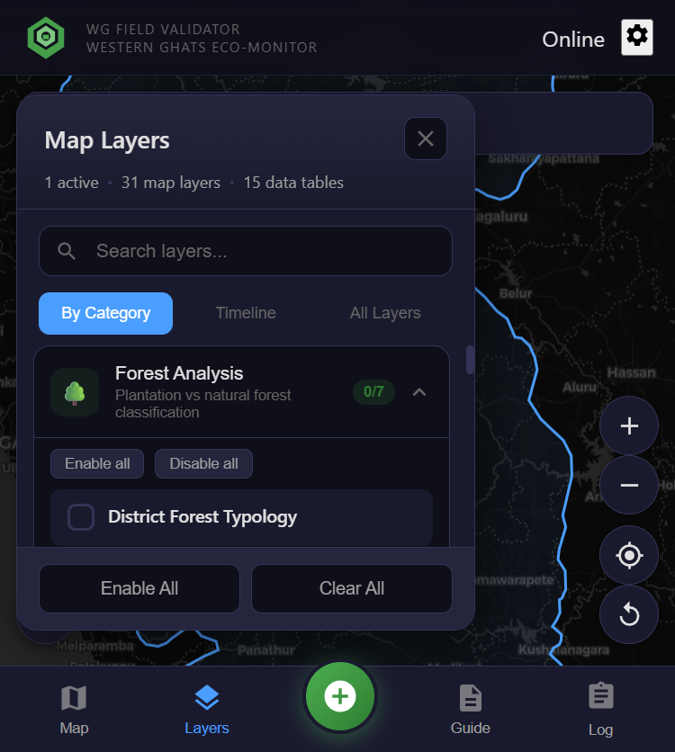
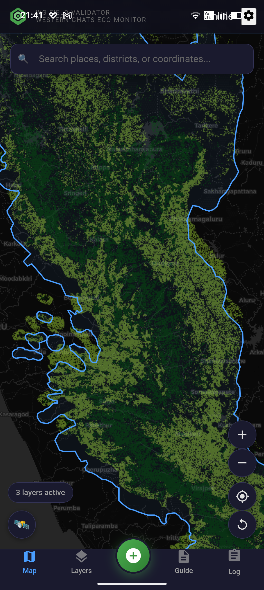
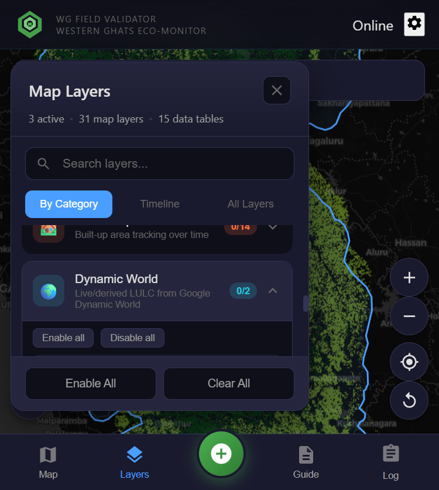
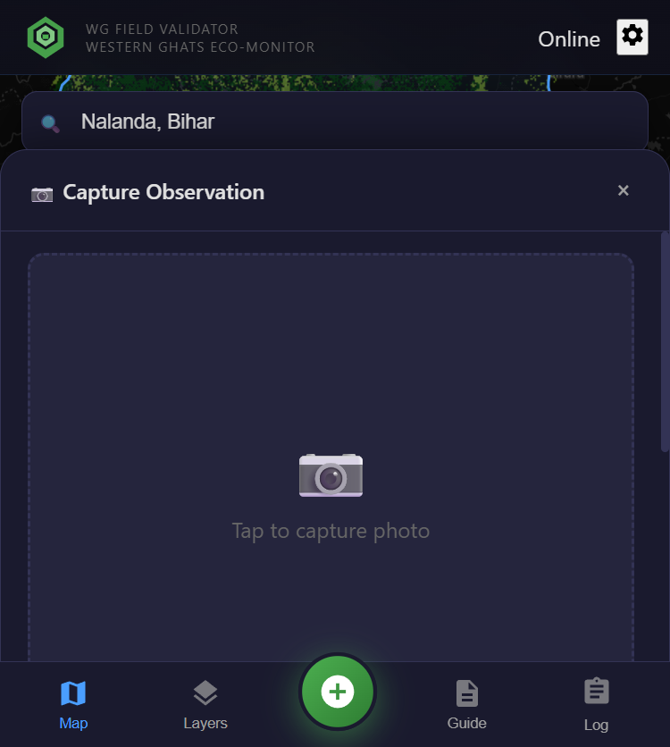
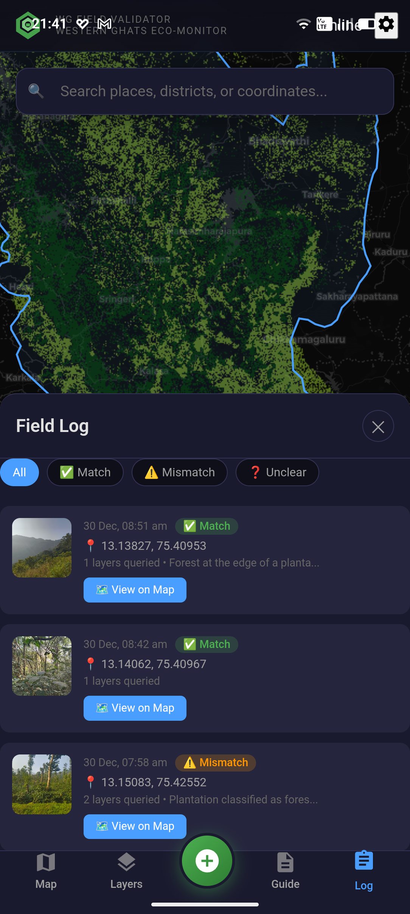
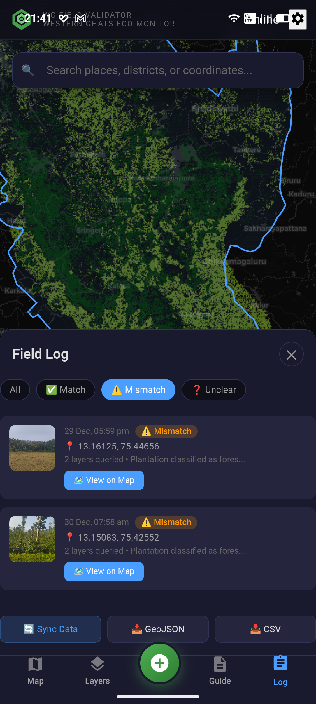
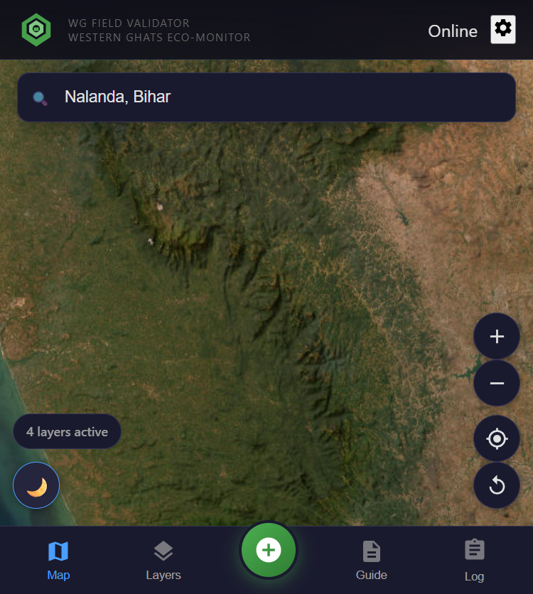

---
pdf_options:
  format: A4
  margin: 15mm 12mm
  printBackground: true
---

# Western Ghats Field Validator

Mobile Application for Ground-Truth Validation of Satellite-Derived Land Cover Classifications

<strong>Key Capabilities:</strong> Offline-first architecture | CoRE Stack API integration (8 endpoints) | Forest vs plantation classification | GPS-based observation capture | JSON/CSV data export

## 1. Overview

The Western Ghats Field Validator is a mobile-first progressive web application that enables field researchers to validate satellite-derived LULC classifications through systematic ground-truth observations. It integrates CoRE Stack watershed APIs, Google Dynamic World, and custom forest typology datasets.

Figure 1: Main interface with Western Ghats boundary

Figure 2: Layer panel with 31 map layers

**Interface Features:** Interactive map with street/satellite base layers | GPS location tracking | Layer toggle with active count | Bottom navigation (Map, Layers, Capture, Guide, Log)

---

## 2. Layer Management

The application organizes **31 map layers** and **15 data tables** across thematic categories:

| Category | Description | Layers |
|----------|-------------|--------|
| Forest Analysis | Plantation vs natural forest classification | 7 |
| Land Cover Maps | Historical LULC from GLC-FCS30D (1985-2022) | 16 |
| Urban Expansion | Built-up area change detection | 14 |
| Dynamic World | Google Earth Engine LULC classification | 2 |
| Boundaries | Administrative boundaries (District, WG) | 2 |
| Watershed Data | Water balance, cropping intensity (CoRE Stack) | 4 |

---

## 3. Forest vs Plantation Classification

Figure 3: Forest typology showing natural forest (green) vs plantations (purple/magenta)

### Classification Methodology

The forest typology distinguishes natural forests from plantations using multi-criteria analysis:

<h3>Natural Forest Indicators</h3>
<ul class="key-list">
<li><strong>Tree cover persistence:</strong> Consistent cover 2000-2020 (Hansen GFC)</li>
<li><strong>Canopy structure:</strong> Multi-layered, heterogeneous heights</li>
<li><strong>Spatial pattern:</strong> Irregular boundaries, internal heterogeneity</li>
<li><strong>Historical use:</strong> No recent clearing/replanting cycles</li>
</ul>

<h3>Plantation Indicators</h3>
<ul class="key-list">
<li><strong>Spectral signatures:</strong> Monoculture reflectance (rubber, teak, eucalyptus)</li>
<li><strong>Row patterns:</strong> Regular geometric planting arrangements</li>
<li><strong>Age uniformity:</strong> Even-aged stands from synchronized planting</li>
<li><strong>Crop cycles:</strong> Periodic harvesting in time-series</li>
</ul>

This distinction is critical for biodiversity assessments: natural forests support significantly higher species diversity than commercial plantations, despite both appearing as "forest" in conventional satellite classifications.

---

## 4. Dynamic World and CoRE Stack Integration

Figure 4: Dynamic World LULC options

<h3>Dynamic World LULC</h3>

Google's near real-time land cover with 9 classes: Water, Trees, Grass, Flooded Vegetation, Crops, Shrub/Scrub, Built-up, Bare Ground, Snow/Ice.

<strong>Options:</strong>

<ul class="key-list">
<li>Live GEE: Real-time via Earth Engine API</li>
<li>Regional (2018-2025): Pre-processed composite</li>
</ul>

### CoRE Stack API Endpoints

| Endpoint | Data Provided |
|----------|--------------|
| `get_admin_details_by_latlon` | State, District, Tehsil lookup from coordinates |
| `get_mwsid_by_latlon` | Micro-Watershed ID for location |
| `get_generated_layer_urls` | Available GIS layers for tehsil |
| `get_tehsil_data` | Comprehensive tehsil-level statistics |
| `get_mws_data` | Time series: Evapotranspiration, Runoff, Precipitation |
| `get_mws_kyl_indicators` | Know Your Landscape watershed indicators |
| `get_waterbodies_data_by_admin` | Waterbody inventory for admin unit |
| `get_mws_report` | MWS assessment report URL |

All endpoints tested and documented in `docs/notebooks/corestack_api_tested.ipynb`.

---

## 5. Field Observation Workflow

Figure 5: Observation capture interface

<h3>Capture Process</h3>
<ol class="key-list">
<li><strong>Photo capture:</strong> Camera or gallery selection</li>
<li><strong>GPS coordinates:</strong> Automatic with accuracy indicator</li>
<li><strong>Layer values:</strong> Active layer data at location</li>
<li><strong>Validation status:</strong>
  <ul>
  <li>Match: Classification agrees with observation</li>
  <li>Mismatch: Classification differs from ground truth</li>
  <li>Unclear: Cannot determine accuracy</li>
  </ul>
</li>
<li><strong>Field notes:</strong> Optional documentation</li>
</ol>

---

## 6. Field Log and Data Export

Figure 6: Field log with validation filtering

Figure 7: Data export options

**Field Log Features:**
- Chronological observation list with photo thumbnails
- Filter by validation status (All, Match, Mismatch, Unclear)
- View observation details and location on map

**Export Capabilities:**
- **JSON:** Complete data with metadata for programmatic analysis
- **CSV:** Tabular format for spreadsheets and GIS software
- **Offline storage:** Local IndexedDB with sync on connectivity

---

## 7. Additional Features

Figure 8: Satellite base map for verification

<h3>Base Map Options</h3>
<ul class="key-list">
<li>OpenStreetMap: Navigation context</li>
<li>ESRI World Imagery: Visual verification</li>
<li>Dark mode: Low-light conditions</li>
</ul>

<h3>Built-in Field Guide</h3>
<ul class="key-list">
<li>Getting started / GPS setup</li>
<li>Navigation and map controls</li>
<li>Layer management</li>
<li>Observation capture workflow</li>
<li>Offline mode operation</li>
</ul>

---

## 8. Technical Architecture and Benefits

| Component | Technology |
|-----------|------------|
| Frontend | React 18 + TypeScript + Vite |
| Mapping | MapLibre GL JS |
| Mobile | Capacitor (Android APK) |
| Storage | IndexedDB (offline-first) |
| APIs | CoRE Stack, OSM Nominatim |

<h3>For Field Researchers</h3>
<ul class="key-list">
<li>Works offline in remote areas</li>
<li>Automatic GPS with accuracy</li>
<li>Multiple layer comparison</li>
</ul>

<h3>For Conservation Organizations</h3>
<ul class="key-list">
<li>Systematic ground-truth validation</li>
<li>Plantation vs forest distinction</li>
<li>Standardized methodology</li>
</ul>

---

## Resources

| Resource | Location |
|----------|----------|
| Sample field observations | `field-data/recovered-observations/` |
| CoRE Stack API notebook | `docs/notebooks/corestack_api_tested.ipynb` |
| Source code | MIT Licensed on GitHub |

Western Ghats Field Validator v1.0.0 | January 2026 | MIT License

