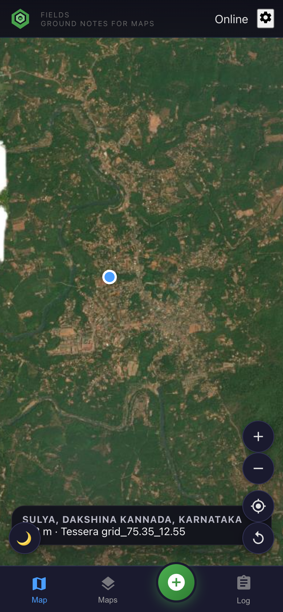

# Flow 1 — Validate CoRE Stack / IndiaSAT in the field

**Goal:** colour the map with IndiaSAT (and other CoRE rasters for this tehsil), walk to a pixel that looks wrong or interesting, photograph the ground, and export a table you can join back to the model.

**Needs internet:** looking up which layers exist, painting WMS tiles, and filling IndiaSAT class after save. **Does not need internet:** GPS, camera, save, bundled forest rasters, already-imported AOI.

---

### 1. Open the map (this is the phone UI)

You should see satellite imagery, a blue GPS dot, **Sulya, Dakshina Kannada, Karnataka** once CoRE admin lookup succeeds, and a Tessera tile id (`grid_75.35_12.55`). The green **+** is capture. **Maps** is layers.

---

### 2. Before you leave — no portal

Gear (top right) → **Before you go out**:

1. Type a taluk or village (`Sulya, Karnataka`) → **Go** (OpenStreetMap; **needs internet that moment**).
2. Or **Choose GeoJSON / KML / CSV** — polygons stay on this phone.

Paste a CoRE Stack API key under **Keys & live maps** ([request one](https://core-stack.org/use-apis/)). Without it, notes still save; live IndiaSAT colouring will not.

---

### 3. Load IndiaSAT and other CoRE maps for this region

Tap **Maps**. CoRE has already listed layers for **this tehsil** (here: “4 maps for Sulya…”). The phone does **not** dump all ~90 GeoServer URLs onto a small screen (many are fat WFS). You get:

- **IndiaSAT land cover** (annual LULC level 3) — year dropdown (e.g. 2024)
- A short list of extra rasters (drainage, water, canopy, LULC) when CoRE generated them for this tehsil

Coverage is uneven: Sulya is rich; some tehsils only have an admin boundary. Capture still works.

Turn **IndiaSAT land cover** on (**needs internet** to fetch WMS tiles). Green / red / yellow on the satellite image is the **model’s guess**, not the truth.

Also turn on **More CoRE Stack maps** checkboxes you care about. Bundled **Forest vs plantation** PNGs work **offline**.

---

### 4. Field evidence (the validation)

Walk or tap the map until the blue dot (or pin) is on the pixel you want to check.

Tap **+**. Do **not** wait for tiles.

1. Photo (camera or gallery).
2. Optional: what you actually see (crop, trees, built-up) in the note; for LULC you can skip species.
3. **Save & keep walking.**

The sheet closes immediately. A toast says maps will fill in later.

**In the background when online:** IndiaSAT `GRAY_INDEX` (class name), CoRE state/district/tehsil, weather. That is your “does the map match?” evidence paired with a geotagged photo.

---

### 5. Export and work with it

**Log** → **GeoJSON** (QGIS), **CSV** (spreadsheet / pandas), **Full backup** (photos + tables).

Useful CSV columns: `lat`, `lon`, `indiasat_class`, `corestack_tehsil`, `notes`, `tessera_tile_id`, photo in the ZIP.

In QGIS: load the GeoJSON, load the same IndiaSAT WMS if you want, style by `indiasat_class` vs your notes. That is the training / QA file for the LULC model — no dashboard required.
