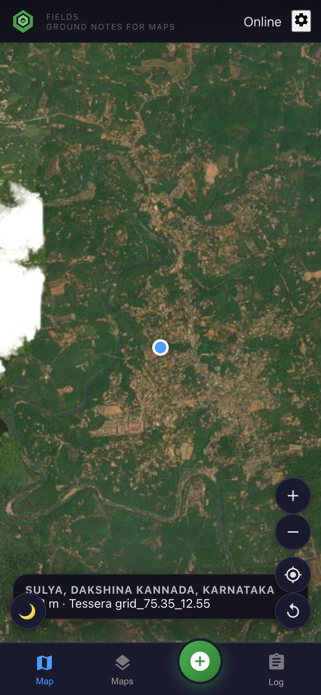
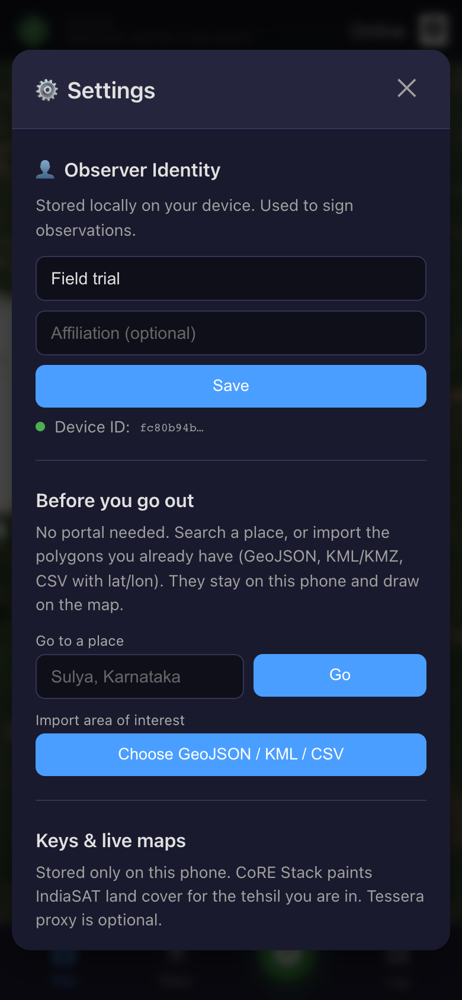
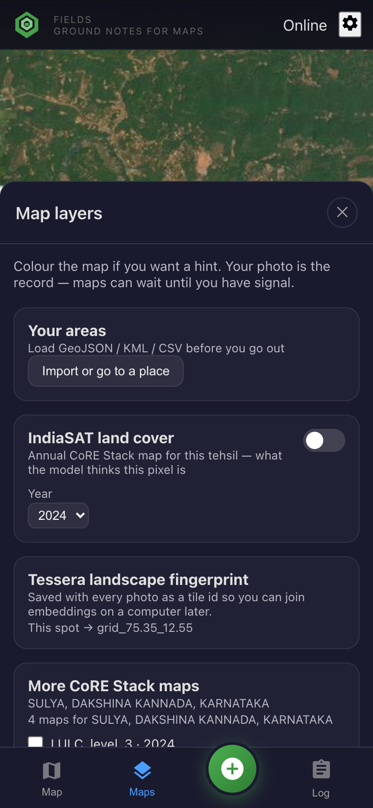
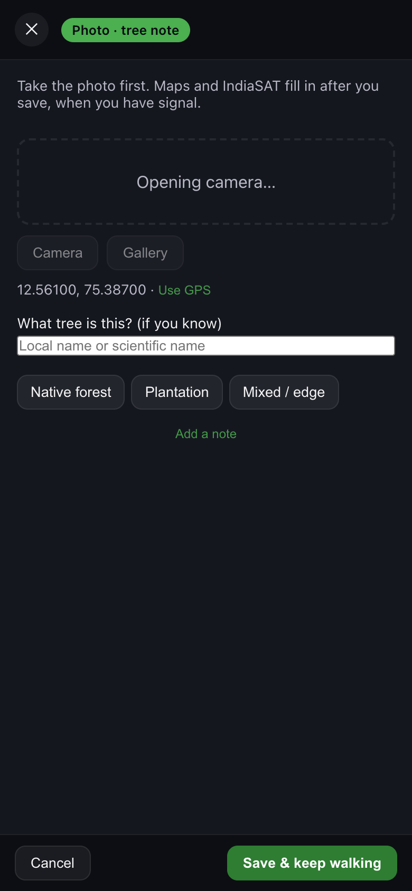
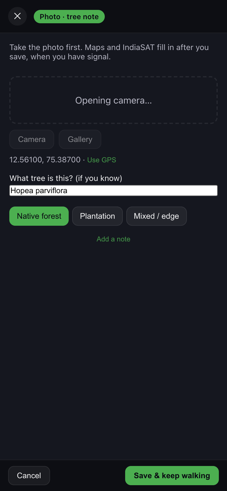
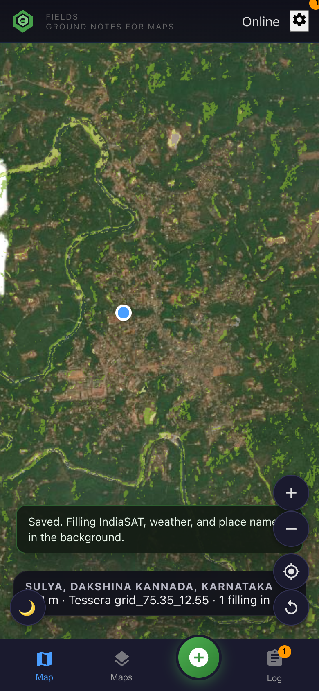
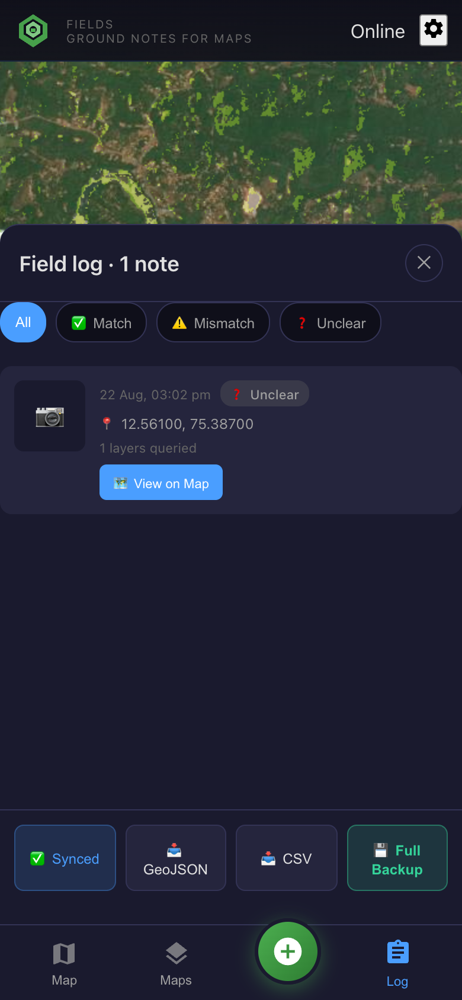

# Flow 2 — Tree species mapping (Tessera join)

**Goal:** photograph trees (name if you know it, native vs plantation), store a **Tessera tile id** on every point, enrich with IndiaSAT/CoRE when you have signal, export a table you can join to Tessera embeddings on a computer.

## What “load Tessera for my AOI” means on a phone

Tessera embeddings are **128-d (or similar) rasters at 10 m**, tiled on a **0.1° grid**. They are **too large to download a whole landscape onto a phone** and paint like IndiaSAT.

| Step | Offline? | What happens |
| --- | --- | --- |
| Compute `tessera.tileId` (`grid_{lon}_{lat}`) | **Yes** — on save | Written on every observation |
| Import your plot polygons | **Yes** after the file is on the phone | Settings → GeoJSON/KML/CSV |
| Optional 128-d **sample** at a point | **No** — needs your Tessera proxy + internet | Settings → Tessera proxy URL; `geotessera` on a laptop/server |
| Join full embedding tiles for the AOI | **Laptop / workstation**, not the phone | After export, use [GeoTessera](https://github.com/ucam-eo/geotessera) / [ucam-eo/tessera](https://github.com/ucam-eo/tessera) with `tessera_tile_id` + year (default 2024) |

So: **you do not preload Tessera rasters for offline colouring.** You preload **where you will walk** (AOI + basemap cache if the PWA has seen those tiles) and you collect **labels**. Internet is a hard dependency only for live CoRE/IndiaSAT colouring and for optional embedding samples — not for the species note itself.

---

### 1. Load the landscape (wifi at camp)

Same as [flow 1](./01-core-stack-lulc-validation.md) steps 1–2:

Import `public/data/sample-sulya-aoi.geojson` or your own plots. The spot bar already shows **Tessera grid_…** for where you are standing.

Under **Tessera landscape fingerprint**: the tile id is what you will join later. Optionally turn on IndiaSAT so you know if the model thinks this pixel is trees vs plantation vs crops.

---

### 2. At the tree

Tap **+**. Camera opens first. GPS is already on the sheet (`Use GPS` if needed).

Collect, in order of value:

1. **Photo** of the bole / canopy / leaves (whatever you can).
2. **Name** if you know it (local or scientific). Typing 3+ letters can suggest GBIF names **if online**; ignore if slow.
3. **Native forest / Plantation / Mixed · edge**.
4. Optional one-line note (flowering, logged, seedlings).

Tap **Save & keep walking**. You are not waiting on Tessera downloads or IndiaSAT.

A yellow dot appears on the map. **Log** shows a badge for notes still enriching.

---

### 3. What runs in the background (when online)

| Job | Source | Why it helps species mapping |
| --- | --- | --- |
| Tessera **tile id** | On device at save | Join key to embeddings |
| IndiaSAT class | CoRE WMS GetFeatureInfo | Context: trees vs orchard vs crops |
| CoRE admin | CoRE API | State / district / tehsil on the CSV |
| Weather | Open-Meteo | Season / conditions |
| Nearby plants | GBIF | Extra names you might have missed |

If you are **offline all day**, you still have photo + GPS + name + stand type + Tessera tile. Enrichment catches up on wifi at the field station.

Optional Tessera **proxy** (`npm run dev:full` or a hosted URL in Settings): samples the embedding at the point. Still not a map of the whole AOI.

---

### 4. Export and work on a computer

- **CSV** — `dominant_species`, `forest_type`, `lat`, `lon`, `tessera_tile_id`, `tessera_year`, `indiasat_class`, `corestack_*`
- **GeoJSON** — same properties on points; drop into QGIS
- **Full backup / GeoAI ZIP** — photos next to the table (what you send a modeller)

**Join recipe (laptop):**

1. Unique `tessera_tile_id` values from the CSV.
2. Download those Tessera tiles for the year on the observation (`tessera_year`).
3. Sample embeddings at each `lat, lon` (or the 10 m cell).
4. Train / evaluate a species head, or overlay points on IndiaSAT for “trees vs plantation” disagreement.

That is the whole loop: phone = evidence; workstation = Tessera + models.
