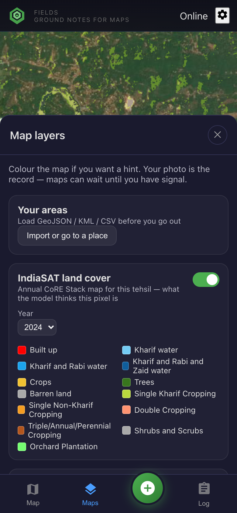
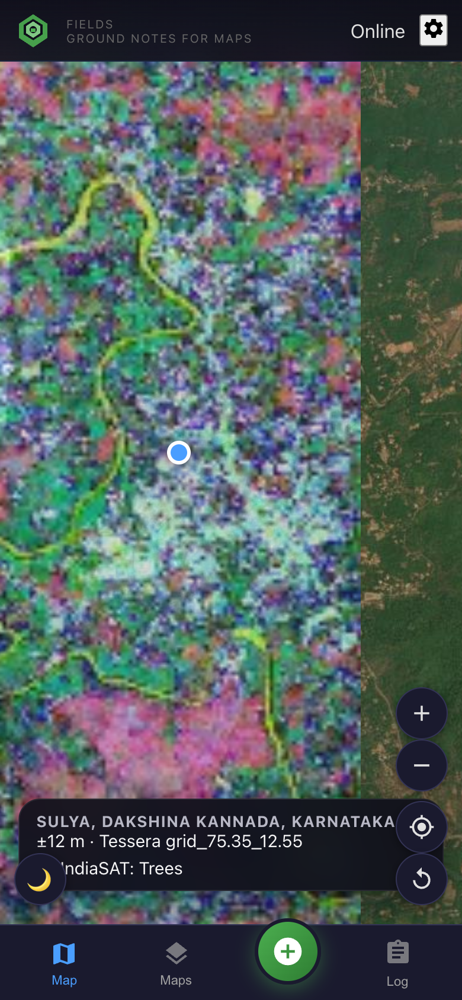

# Field flows

Open the HTML in a browser (editor Markdown often hides images), or the PDF on GitHub.

| Flow | What you see on the map | Open |
| --- | --- | --- |
| 1 · **IndiaSAT validation** | CoRE WMS class colours (trees / orchard / crop / water / built-up) | [HTML](./01-indiasat-validation.html) · [PDF](./01-indiasat-validation.pdf) |
| 2 · **Tessera tree species** | One 0.1° RGB fingerprint (embedding bands 30/60/90), plus a species note | [HTML](./02-tessera-tree-species.html) · [PDF](./02-tessera-tree-species.pdf) |
| 3 · **Offline maps** | OSM streets + Sentinel-2 cached on the phone (Save maps) | [HTML](./03-offline-maps.html) · [md](./03-offline-maps.md) |

IndiaSAT and Tessera are mutually exclusive colour overlays (turning one on turns the other off). OSM streets and Sentinel-2 are a separate cached basemap stack.

  
  
  

